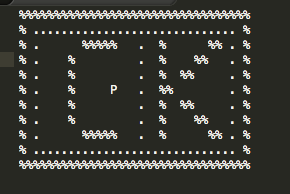
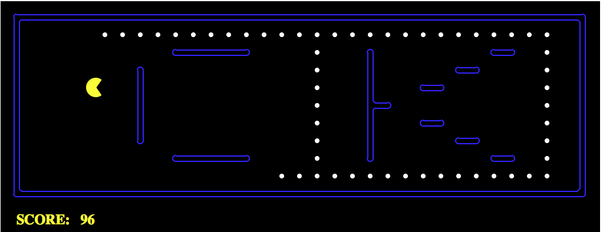

# AI-Designing-Pac-Man_Agents

### Step 7: A Random Agent
1. Describe behavior of RandomAgent

  * tinyMaze: The agent chooses one random action from an array of available actions. The game runs until the agent eats the capsule. The agent moves randomly and quickly and has continuous movements. In the tinyMaze environment, the agent completed the game relatively quickly compared to the mediumMaze due to the less amount of walls. It eventually will always get the food but the time it will take is not predetermined. 

  * mediumMaze: We used the openSearch layout and the agent was also moving randomly and quickly, but does not look for the food. It took a longer time, more steps, and had a lower score. When the agent finds food, it does not continue in that direction and just moves randomly, oftentimes moving in circles in a blank section of the environment without any food. 
  
### Step 8: Exploring Environments
1. Screenshot of myLayout.lay 

2. Describe the agent's behaviour in myLayout and openSearch environment

  * openSearch: The agent randomly picks directions without regarding to locations of food. It takes longer for the agent to eat a pellete towards the end. It takes about 4 minutes for the agent to finish the game with 100% win rate, since there is no ghost in this layout. The score is around -250 because of the excessive aimless movements.

  * myLayout: It takes much longer for the agent to finish the game because myLayout is more complicated than openSearch. The agent picks random movement with no regards to the location of food. The score is negative and much lower than in openSearch. Win rate is 100% since there is no ghost in the layout.

### Step 9: A Better Random Agent
1. Describe behavior of RandomAgent without stop action

  * openSearch: The agent moves much faster without stop as an available action. It chooses randomly, and often between two opposite directions multiple times. It does not eat the pellets in any order, and once the agent has ate all the pellets in a part of the environment it can stay in that empty part for a long time moving somewhat circularly without eating other pellets. Average score out of 3 games is -142.0 with a 100% win rate because there are no ghosts in this environment.

  * myLayout: The agent moves around the board randomly, often getting in circle within the parts of the maze that have many walls. It has a 100% win rate and an average score of -676.0 out of 5 games. The agent does not have any perception of pellets and does not seek them out. 

### Step 10: Reflex Agents: Adding Percepts
1. Pac-man can perceive:

  * His position: __gameState.getPacmanPosition()__
  * The position of all of the ghosts: __gameState.getGhostPositions()__
  * The locations of the walls: __gameState.getWalls()__
  * The positions of the capsules: __gameState.getCapsules()__
  * The positions of each food pellete: __gameState.getFood()__
  * The total number of food pellets still available: __gameState.getNumFood()__
  * Whether he has won or lost the game: __gameState.isLose()__, __gameState.isWin()__ 
  * His current score in the game: __gameState.getScore()__

2. Describe the agent's behaviours in myLayout and openSearch environment
  
  * openSearch: It takes much less than compared to RandomAgent. In the begining, since the agent is surrounded by pelletes, it picks a direction randomly and follows the path of pelletes. It is able to sense pellete right next to it from all directions, and move towards the pellete. The average score is about 1003 with 100% win rate.

  * myLayout: Initially the agent picks random directions because there is no pallete nearby, but as soon as a pallete is next to it, it quickly eats the pellete and move to the next one. myLayout has pelletes lining up, and the agent follows the lines where pelletes are. Towards the end when only one line of pelletes is left, the agent moves randomly again until it is next to a pellete, then it follows the line and eats every one of them. In this case, the agent is able to sense pelletes next to it, and orient itself towards where the pelletes are. It takes about less than one minute for the game to finish, with score 1193.0 and 100% win rate. 

3. Project Reflection 
  By doing this project, I learned a lot about the methods and code environment of Pac-Man game. By programming randomAgent and ReflexAgent, I was able to understand how agent makes basic movements with respect to the environment. The assignment also helped me learn a bit more about python and pair programming. 
